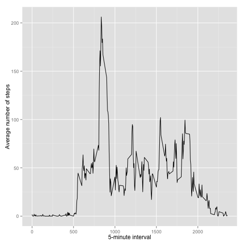

##Title: Reproducible Research: Peer Assessment 1

## Loading and preprocessing the data

```r
#load dataset
if(!file.exists('activity.csv')){
    unzip('activity.zip')
}
activity <- read.csv('activity.csv')
```


## What is mean total number of steps taken per day?


```r
#Calculate the total number of steps taken per day
interval_totalSteps <- aggregate(x=list(steps=activity$steps),
                                 by=list(interval=activity$date), 
                                 FUN=sum, na.rm=TRUE)

#Make a histogram of the total number of steps taken each day
library(ggplot2)
qplot(interval_totalSteps$steps, xlab='Sum of steps per day', ylab='Count', binwidth=500)
```

 

```r
#Calculate and report the mean and median of the total number of steps taken per day
mean(interval_totalSteps$steps)
```

```
## [1] 9354.23
```

```r
median(interval_totalSteps$steps)
```

```
## [1] 10395
```


## What is the average daily activity pattern?

```r
#Make a time series plot (i.e. type = "l") of the 5-minute interval (x-axis) and the average number of steps taken, averaged across all days (y-axis)
average_stepsPerDay <- aggregate(x=list(steps=activity$steps),
                                 by=list(interval=activity$interval),
                                 FUN=mean, na.rm=TRUE)
ggplot(data=average_stepsPerDay, aes(x=interval, y=steps)) +
    geom_line() +
    xlab("5-minute interval") +
    ylab("Average number of steps")
```

 

```r
#Which 5-minute interval, on average across all the days in the dataset, contains the maximum number of steps?
average_stepsPerDay[which.max(average_stepsPerDay$steps),]
```

```
##     interval    steps
## 104      835 206.1698
```

## Imputing missing values

```r
#Calculate and report the total number of missing values in the dataset
sum(is.na(activity$steps))
```

```
## [1] 2304
```

```r
#Devise a strategy for filling in all of the missing values in the dataset
#Answer: Fill missing values with mean

#Create a new dataset that is equal to the original dataset but with the missing data filled in
new_activity <- activity
for (i in 1:nrow(new_activity)) {
    if (is.na(new_activity$steps[i])) {
        new_activity$steps[i] <- average_stepsPerDay[
            which(new_activity$interval[i] == average_stepsPerDay$interval), ]$steps
    }
}

#Make a histogram of the total number of steps taken each day and Calculate and report the mean and median total number of steps taken per day.
interval_totalSteps <- aggregate(x=list(steps=activity$steps),
                                 by=list(interval=activity$date),
                                 FUN=sum, na.rm=TRUE)

qplot(interval_totalSteps$steps, xlab='Sum of steps per day', ylab='Count', binwidth=500)
```

 

```r
mean(interval_totalSteps$steps)
```

```
## [1] 9354.23
```

```r
median(interval_totalSteps$steps)
```

```
## [1] 10395
```

```r
#Do these values differ from the estimates from the first part of the assignment? What is the impact of inputting missing data on the estimates of the total daily number of steps?
#Answer: Yes, both new mean and median are significantly higher than previous. Inputting missing data drives up the nominal values by replacing 0s (NAs).
```


## Are there differences in activity patterns between weekdays and weekends?

```r
new_activity$dateType <-  ifelse(as.POSIXlt(new_activity$date)$wday %in% c(0,6), 'weekend', 'weekday')
new_activity <- aggregate(steps ~ interval + dateType, data=new_activity, mean)
ggplot(new_activity, aes(interval, steps)) + 
    geom_line() + 
    facet_grid(dateType ~ .) +
    xlab("5-minute interval") + 
    ylab("Average number of steps")
```

 
